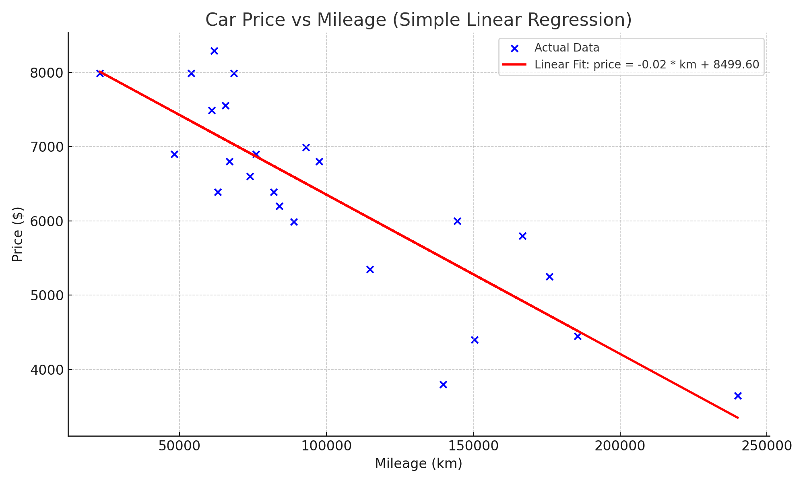

## Linear Regression

Linear regression is a type of predictive statistical analysis used to estimate the value of a **dependent variable** (output) based on one or more **independent variables** (inputs).

In this project, we apply **simple linear regression** to predict the **price of a car** based on its **mileage**.

---

### Simple Linear Regression

In its simplest form, linear regression assumes a linear (straight-line) relationship between the input and output variables. The model is represented by the equation:

```ini
price = θ1 × mileage + θ0
```
Where:
- `price` is the **dependent variable** (the value we want to predict).
- `mileage` is the **independent variable** (the input used to make predictions).
- `θ1` (theta1) is the slope of the line (also known as the regression coefficient), representing how much the price changes as mileage increases.
- `θ0` (theta0) is the y-intercept, indicating the estimated price when mileage is 0.



### Objective
The goal of linear regression is to find the optimal values for the parameters (θ0 and θ1) that minimize the difference between the predicted prices and the actual prices in the dataset.

This difference is typically measured using a cost function such as Mean Squared Error (MSE).